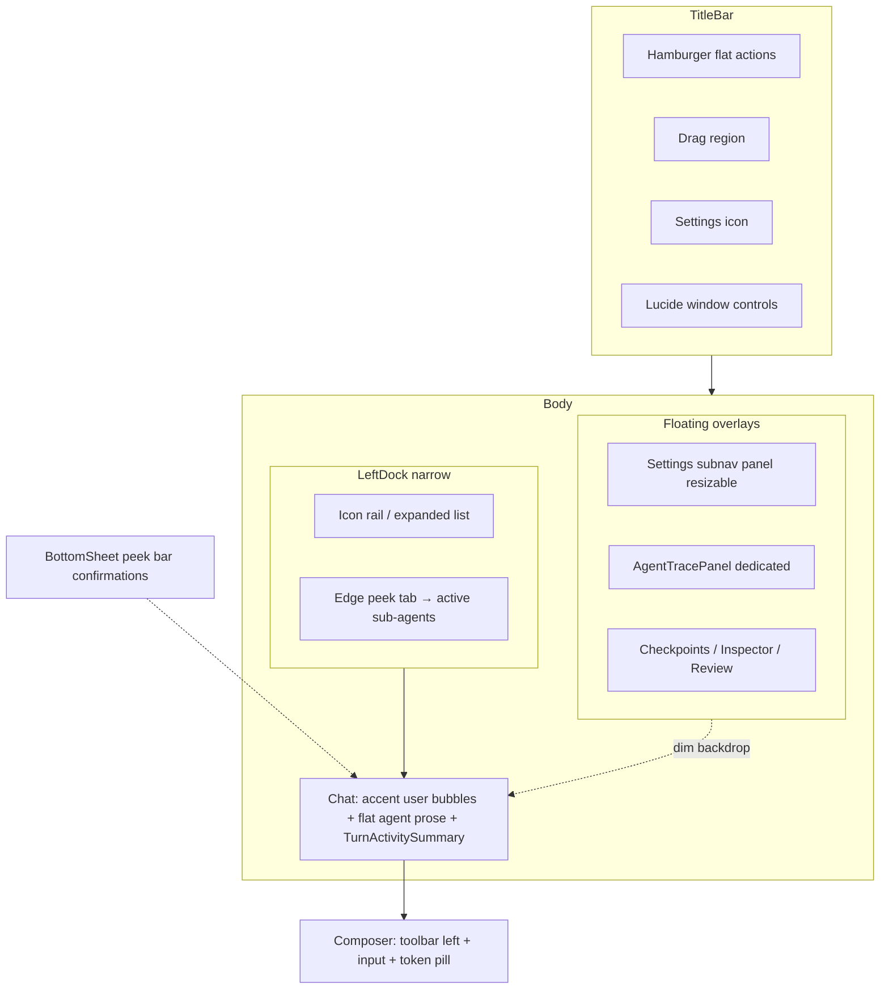

---

name: Complete UI Redesign

overview: "Cursor-inspired full UI rethink: warm-amber accent, dark/light/system themes, frameless hamburger title bar, narrow icon-rail dock with sub-agent edge-peek, resizable floating panels, settings subnav, bottom-sheet confirmations, sub-agents in dedicated floating panel with orchestrator-monitored TurnActivitySummary — one index.css, Lucide-only."

todos:

  - id: tokens-css

    content: "Rewrite index.css: dual-theme tokens, warm accent, bottom-sheet/floating-panel/agent-panel primitives, timeline markdown dedupe; delete styles/tokens.css"

    status: completed

  - id: theme-system

    content: theme.ts + settings (theme, density, reducedMotion) + Appearance nav + Electron nativeTheme sync

    status: completed

  - id: ui-primitives

    content: BottomSheet, FloatingPanel, AgentTracePanel, AttachmentPreviewPanel, LoadingHint; Spinner→Loader2

    status: completed

  - id: app-shell

    content: TitleBar (no brand, hamburger flat actions, settings icon); narrow dock + edge-peek sub-agents; float overlay system

    status: completed

  - id: composer

    content: Toolbar-left, send/stop, token+context pills, model favorites, attachment cards, drag-drop, external file ingest to app_data

    status: completed

  - id: attachments-backend

    content: Extend user-prompt schema, attachment store (app_data path layout), IPC ingest, timeline persistence, always-inline orchestrator context

    status: completed

  - id: timeline

    content: Composer status strip, TurnActivitySummary, remove LiveStatusRow/JumpChip, tool hover-scrub+floating diff, center-turn scroll, LoadingHint

    status: completed

  - id: subagent-ux

    content: Remove timeline trace; dock hover-peek; AgentTracePanel; extend main-process sub-agent status events

    status: completed

  - id: panels

    content: Settings subnav, simplified checkpoint review (diff-only tab), archive meta+UI, memory last-ref tracking, bottom sheets

    status: completed

  - id: audit-harden

    content: Lucide audit, token sweep, overlay cleanup, tests as needed, full smoke pass

    status: completed

isProject: false

---

# Complete Vyotiq UI/UX Redesign

## Confirmed design decisions (all questionnaire rounds)

### Core visual

| Area       | Choice                                                                |

| ---------- | --------------------------------------------------------------------- |

| Vibe       | Cursor-inspired; **full rethink** allowed                             |

| Themes     | Dark + Light + System; both themes equally polished                   |

| Accent     | Warm amber/gold                                                       |

| Font       | Geist Variable + Geist Mono (implementation pick)                     |

| Density    | Balanced (+ user-selectable in Appearance later)                      |

| Chat text  | Medium ~15px                                                          |

| Borders    | Hairlines where needed                                                |

| Animation  | Moderate; **respect reduced motion** via Settings toggle + OS default |

| Focus ring | Warm amber keyboard focus ring                                        |

| Scrollbars | Stealth (thin, fade when idle)                                        |

| CSS        | One `[index.css](src/renderer/index.css)`; TS class helpers OK        |

### Title bar

| Area            | Choice                                                                                    |

| --------------- | ----------------------------------------------------------------------------------------- |

| Branding        | **No app name/logo** — hamburger + actions only                                           |

| Workspace       | **Dock only** — title bar stays clean                                                     |

| Menu            | **Hamburger → flat action list** (all current File/Edit/View actions, no nested submenus) |

| Window controls | Custom Lucide on the right                                                                |

| Settings access | Settings icon in title bar (opens floating panel)                                         |

| Shortcuts       | **Dedicated section in Settings left nav** (not title bar help icon)                      |

### Left dock

| Area          | Choice                                                                     |

| ------------- | -------------------------------------------------------------------------- |

| Default state | Remember last expanded/collapsed                                           |

| Collapsed     | Icon rail                                                                  |

| Expanded      | Full workspace + chat list                                                 |

| Width         | **Narrower ~200px** default (still resizable within sensible min/max)      |

| Search        | **Inline footer expand** (icon → field)                                    |

| New chat      | Compact **plus in dock toolbar** (implementation pick — obvious, not loud) |

| Active run    | Refined **shimmer pill** on running chat tab                               |

### Floating panels (Settings / Checkpoints / Inspector / Review)

| Area        | Choice                                               |

| ----------- | ---------------------------------------------------- |

| Behavior    | **Float over chat** with dim-only backdrop (no blur) |

| Width       | **User-resizable** drag edge (like dock)             |

| Chat layout | Chat stays full width underneath — no push           |

### Settings panel

| Area       | Choice                                                                                     |

| ---------- | ------------------------------------------------------------------------------------------ |

| Layout     | **Left subnav + right content**                                                            |

| Nav items  | Providers, Permissions, Context, Checkpoints, Memory, **Appearance**, **Shortcuts**, About |

| Providers  | **Master-detail** — provider list + selected provider form in content area                 |

| Appearance | Theme (dark/light/system) + **density** + **reduced motion** toggle                        |

### Checkpoints & Inspector (implementation defaults where you deferred)

| Area           | Choice                                                                                  |

| -------------- | --------------------------------------------------------------------------------------- |

| Checkpoints    | **Match Settings** — left subnav (Runs / Files / Review) + content                      |

| Inspector      | **Accordion sections** in single scroll — optimized for scanning dense debug data       |

| Pending review | **Both** — quick inline actions in timeline row + full review in Checkpoints Review tab |

| Diff view      | **Unified/split toggle** in diff toolbar                                                |

### Composer

| Area         | Choice                                                             |

| ------------ | ------------------------------------------------------------------ |

| Shape        | Single flat box                                                    |

| Toolbar      | **Icons row to the left of textarea** (model, attach, permissions) |

| Send         | **Icon send ↔ stop swap** while running                            |

| Token pill   | **Footer-right** monospace meter                                   |

| Model picker | **Recent + favorites** at top, then provider groups                |

| Stop run     | **Composer only** (send becomes stop)                              |

### Timeline & chat

| Area           | Choice                                                                                   |

| -------------- | ---------------------------------------------------------------------------------------- |

| User messages  | **Subtle bubble with faint warm accent tint**; left-aligned in agent column rail         |

| User actions   | **Copy on hover** only                                                                   |

| Agent messages | Flat prose, no bubble                                                                    |

| Empty chat     | **Truly blank** — composer only                                                          |

| Run separators | **Timestamp + meta status + spacing** — no divider bar or badge                          |

| Tool rows      | **Collapsed one-line**; **click row to expand**; inline in activity stream               |

| File edits     | **One-line path + diff stats**; expand for full diff                                     |

| Markdown       | Full GFM styled cleanly                                                                  |

| Errors         | Inline notice row for run failures + toast for critical API issues (implementation pick) |

### Sub-agents (major UX change)

| Area                | Choice                                                                                                                                                                                                                           |

| ------------------- | -------------------------------------------------------------------------------------------------------------------------------------------------------------------------------------------------------------------------------- |

| Timeline trace      | **Remove nested sub-agent trace from timeline**                                                                                                                                                                                  |

| Timeline monitoring | **Refine `[TurnActivitySummary](src/renderer/components/timeline/activity/TurnActivitySummary.tsx)`** — orchestrator actively monitors sub-agents and streams concise inline progress updates in the parent turn's activity lane |

| Dock                | **Thin vertical peek tab** on dock inner edge — hover/click slides out list of active sub-agents                                                                                                                                 |

| Detail view         | **Dedicated AgentTracePanel** (floating, log/diff-optimized) — separate chrome from Settings panel but same overlay infrastructure                                                                                               |

| Click sub-agent     | Opens AgentTracePanel with full trace, tool output, diffs                                                                                                                                                                        |

### Bottom sheets & dialogs

| Area                | Choice                                                                                  |

| ------------------- | --------------------------------------------------------------------------------------- |

| Confirmations       | **Bottom sheet** with **peek bar** first — expand for full content                      |

| Edit approval       | **Diff preview inside sheet** + Allow/Deny                                              |

| Revert preview      | **Bottom sheet** (expandable from peek)                                                 |

| Destructive buttons | Red outline on hover path, solid red fill for primary destructive (implementation pick) |

### Loading & toasts

| Area    | Choice                     |

| ------- | -------------------------- |

| Loading | Small spinner + muted text |

| Toasts  | Bottom-right stack         |

### Permissions, attachments, timeline utilities

| Area                  | Choice                                                                                                                                            |

| --------------------- | ------------------------------------------------------------------------------------------------------------------------------------------------- |

| Permissions           | **Both** — quick toggles in composer popover + full config in Settings → Permissions                                                              |

| Permission indicator  | **Small pill on composer** showing Ask / Auto mode at a glance                                                                                    |

| Attachments           | **Timeline-style inline cards** under user prompt (and same card preview in composer before send); all file types; **images = rounded thumbnail** |

| Drag-and-drop         | **Yes** — drop files on composer to attach                                                                                                        |

| Attachment limits     | **Show max count in UI** + toast when limit hit                                                                                                   |

| Image click           | Thumbnail → **floating preview panel**                                                                                                            |

| PDF click             | **Same floating preview panel** as images (in-app)                                                                                                |

| Send rules            | Text-only, attachment-only, or both — all allowed                                                                                                 |

| @-mentions            | **Keep** — restyle mention menu if composer supports @ today                                                                                      |

| Composer height       | **Auto-grow** with text up to max, then scroll inside                                                                                             |

| Find in chat          | **Keep** find bar — restyled minimal                                                                                                              |

| Jump to latest        | **Soft auto-scroll** unless user scrolled up recently                                                                                             |

| Context budget        | **Context % pill** in composer footer; click opens Inspector                                                                                      |

| Pending badge         | **Timeline row only** — no dock/settings badge                                                                                                    |

| Memory panel          | Searchable list + **last-referenced-in-chat** meta                                                                                                |

| About                 | Version + **check for updates**                                                                                                                   |

| Archive chats         | **Archive** hides from main list; view in Archived section                                                                                        |

| Pin chats             | **Skip in v1** — archive only                                                                                                                     |

| Default Settings tab  | **Appearance on first launch only**; remember last tab after                                                                                      |

| Providers status      | **Show only on error** — quiet when healthy                                                                                                       |

| Local providers       | **Separate Local group** in model picker + Settings                                                                                               |

| Checkpoint auto-save  | **Silent** — no UI feedback                                                                                                                       |

| Workspace path prompt | **Bottom sheet** for folder path input                                                                                                            |

| Light theme surfaces  | **Warm paper** off-white (not cool neutral white)                                                                                                 |

| Floating panel width  | **Remember last width per panel type** separately                                                                                                 |

| Close floating panel  | **X + Escape + click dim backdrop**                                                                                                               |

| Delegate row          | **One quiet line** in timeline when sub-agent starts                                                                                              |

| SubAgentFocusModal    | **Remove** — replaced by AgentTracePanel                                                                                                          |

| Activity summary      | **~5 recent orchestrator steps** visible; expand for more                                                                                         |

| Toasts                | Errors persistent until dismiss; success brief; Undo where useful                                                                                 |

---

## Codebase-informed questionnaire (confirmed)

These answers came from parallel codebase analysis + follow-up questions. Items **not** repeated above.

### Attachments — new backend + UI (major scope increase)

| Area             | Choice                                                                                                              |

| ---------------- | ------------------------------------------------------------------------------------------------------------------- |

| Scope            | **External upload** — not workspace paths only (today: path picker only)                                            |

| Persistence      | **Extend user-prompt events** with attachment metadata so timeline cards survive reload                             |

| Local storage    | Copy/store under **app user data**, structured: `{appData}/attachments/{workspaceId}/{conversationId}/{messageId}/` |

| Drag-and-drop    | Yes — drop on composer                                                                                              |

| Max per message  | **10 files** (show `N/10` in **composer footer**)                                                                   |

| Image thumbnails | Any decodable **image/** MIME                                                                                       |

| PDF              | In-app via **shared AttachmentPreviewPanel**                                                                        |

| Text/code files  | **Text preview** in same shared panel (.txt, .md, .json, etc.)                                                      |

| Other files      | Type icon card; click opens system default app                                                                      |

| Agent context    | **Always inline** full attachment content/paths into orchestrator envelope on send (not on-demand read-tool only)   |

| Sub-agents       | Same full attachment context available when orchestrator delegates                                                  |

| Max file size    | **10 MB per file** — toast on reject                                                                                |

| Workspace picks  | **Hybrid** — in-workspace files stay as project paths; external drops copied to app_data                            |

| Archive action   | **Chat row context/hover menu** — Archive alongside Delete                                                          |

**Main-process work required:** attachment ingest IPC, disk layout, schema changes in `[src/shared/types/chat.ts](src/shared/types/chat.ts)`, send path in `[AgentV.ts](src/main/orchestrator/AgentV.ts)`, renderer `[Composer.tsx](src/renderer/components/composer/Composer.tsx)` + `[UserPromptRow.tsx](src/renderer/components/timeline/rows/UserPromptRow.tsx)`.

### Archive, chat organization

| Area         | Choice                                                                                    |

| ------------ | ----------------------------------------------------------------------------------------- |

| Storage      | `**archived` flag on `ConversationMeta`** in conversation store (new — not settings list) |

| Dock UI      | **Collapsed "Archived" section** at bottom of chat list                                   |

| Pin chats    | **Not in v1**                                                                             |

| Drag reorder | **Keep** drag-to-reorder chats in dock                                                    |

| Export chat  | **Skip v1** (feature does not exist today)                                                |

### Shell, panels, chrome

| Area                    | Choice                                                                        |

| ----------------------- | ----------------------------------------------------------------------------- |

| Title bar height        | **34px**                                                                      |

| Empty chat              | **Remove example prompt chips** — blank timeline (matches plan)               |

| PeakContextBadge        | **Remove from dock** — replaced by composer context % pill only               |

| RunningElsewhereHint    | **Remove** in redesign                                                        |

| Panel on launch         | **Always closed** — do not restore last open panel                            |

| Panel backdrop          | **Dim only** (no blur)                                                        |

| Dock resize clamp       | **180–320px** (default ~200; today 220–360)                                   |

| Checkpoints default tab | **Review if pending changes**, else Runs                                      |

| Shortcuts               | **Settings nav only** — remove title bar Help popover                         |

| Hamburger Edit          | **All six** actions (Undo/Redo/Cut/Copy/Paste/Select All)                     |

| Updates                 | **Auto-check on launch** + toast if update available + manual button in About |

### Review, orchestrator, memory

| Area                   | Choice                                                                                                              |

| ---------------------- | ------------------------------------------------------------------------------------------------------------------- |

| Review session         | **Simplify** — drop PR-style comment threads and review export                                                      |

| Review tab             | **Diff-only viewer** — read-only diffs in Checkpoints Review tab                                                    |

| Accept/Reject          | **Primary in timeline pending row** (+ pending list); Review tab does not host actions                              |

| Orchestrator events    | **OK to extend main process + IPC** for TurnActivitySummary sub-agent monitoring                                    |

| Memory last-ref        | **Build tracking** — update on **memory recall tool** (and explicit memory writes), show last conversation per note |

| Model favorites        | Persist in `**ui.favoriteModels`** in settings                                                                      |

| Density                | Changes **spacing tokens + row/composer/dock heights + font steps** globally via CSS                                |

| Agent peek trigger     | **Hover** peek tab → quick agent list preview; **click agent** → AgentTracePanel                                    |

| Updates implementation | `**electron-updater`** — auto-check on launch, toast if available, manual button in About                           |

---

## Timeline, streaming, scroll, and loading (confirmed)

From codebase analysis + timeline-focused questionnaire. **Do not re-ask** these in implementation.

### Live run monitoring (split roles)

| Surface                   | Role                                                                                                                            |

| ------------------------- | ------------------------------------------------------------------------------------------------------------------------------- |

| **Composer footer strip** | Single updating **current phase line** `Editing auth.ts`, `Delegating…`, tok/s if needed) between token/context pills and send |

| **TurnActivitySummary**   | **Step history list** in activity lane (max ~5 orchestrator + sub-agent steps); expand for more                                 |

| **LiveStatusRow**         | **Remove** — replaced by composer strip + TurnActivitySummary                                                                   |

| **JumpToLatestChip**      | **Remove** — soft follow + center-new-turn scroll replaces it                                                                   |

### Tool rows during streaming (combined D+E)

| Behavior            | Detail                                                                                           |

| ------------------- | ------------------------------------------------------------------------------------------------ |

| Timeline default    | **Collapsed one-line** header (path/command + stats)                                             |

| Hover               | **Scrub preview** of streaming output on the row without full expand                             |

| Live file edit diff | **Auto-open floating diff panel** (shared preview infrastructure) beside chat while edit streams |

| After settle        | Row stays one-line; full detail on click expand inline                                           |

Disable today’s **auto-expand tool group** during streaming unless user manually expanded.

### Scroll behavior

| Behavior    | Detail                                                                                            |

| ----------- | ------------------------------------------------------------------------------------------------- |

| New turn    | **Center new turn** in viewport when user sends; then **gentle tail-follow** as content grows     |

| Follow mode | **Smooth scroll** when pinned/following (not instant jump)                                        |

| Unstick     | Soft unstick when user scrolls up (~80px threshold); no JumpToLatestChip                          |

| Tool growth | When pinned, follow height changes from **tool rows/partial diffs** too (not just assistant text) |

| Send snap   | Use center-new-turn model rather than hard snap-to-bottom-only                                    |

### Reasoning

| Behavior                    | Detail                                      |

| --------------------------- | ------------------------------------------- |

| While streaming             | Reasoning visible in activity lane          |

| When assistant prose starts | **Fade/collapse to compact block** over ~1s |

| Manual                      | User can expand anytime after collapse      |

### Streaming markdown

| Behavior | Detail                                                      |

| -------- | ----------------------------------------------------------- |

| Cursor   | **None** — plain streaming text                             |

| Handoff  | Keep stream → GFM handoff at `agent-text-end`; restyle only |

### Turn layout

| Behavior        | Detail                                                                                                                                            |

| --------------- | ------------------------------------------------------------------------------------------------------------------------------------------------- |

| Partition       | **Do not use** separate `activityresponse` render paths — **wire-order stream** in `TurnInlineStream` (delete unused partition layout if dead) |

| Run complete    | Keep subtle **RunCompleteRow** footer (duration, tokens, edits) — plan default                                                                    |

| Agent-thought   | Keep **muted inline** harness warning rows — plan default                                                                                         |

| Context-summary | Fold to **one line in TurnActivitySummary** — plan default                                                                                        |

| Stepfade        | Keep on completed turns **unless reduced motion** enabled                                                                                         |

### Loading states

| Surface                 | Behavior                                                                           |

| ----------------------- | ---------------------------------------------------------------------------------- |

| **Conversation switch** | **Spinner + "Loading conversation…"** when unhydrated (not blank onboarding flash) |

| **Lazy panels**         | **Spinner + muted text** in panel body (replace `Suspense fallback={null}`)        |

| **Everywhere else**     | Shared `**LoadingHint`** component (Spinner + message); replace ad-hoc patterns    |

| **Empty chat**          | Truly blank when loaded and empty (remove example prompt chips)                    |

### Sub-agents in timeline (unchanged from prior)

- Remove inline trace; one delegate line; activity summary gets orchestrator-monitored sub-agent steps; hover dock peek + AgentTracePanel

### Main-process events (unchanged)

- OK to extend orchestrator `run-status` / events for richer TurnActivitySummary + composer strip telemetry

---

## Architecture diagram

---

## Theme system (required)

Implement `[src/renderer/lib/theme.ts](src/renderer/lib/theme.ts)` (fixes broken import in `[App.tsx](src/renderer/App.tsx)`):

- `ui.theme`: `'dark' | 'light' | 'system'`

- `ui.density`: `'compact' | 'balanced' | 'airy'` (CSS `data-density` attribute)

- `ui.reducedMotion`: boolean (overrides animations/shimmer when true; default respects OS)

- `applyAppTheme()` before first paint in `[main.tsx](src/renderer/main.tsx)`

- Dual token blocks in `[index.css](src/renderer/index.css)`: `@theme` dark defaults + `[data-theme="light"]` overrides

- Sync Electron `nativeTheme.themeSource` when explicit dark/light chosen

---

## Sub-agent implementation notes

This is the largest **structural UX** change beyond restyling:

1. **Timeline reducer / row derivation** — stop rendering `[SubAgentTrace](src/renderer/components/timeline/subagent/SubAgentTrace.tsx)`, iteration panels, and nested sub-agent rows in main transcript; keep delegate announcement minimal if needed

2. **Orchestrator → renderer events** — ensure parent turn's activity lane receives live sub-agent status updates (extend existing timeline events or activity summary props); updates must be **inline, concise, monitored** (not full trace dumps)

3. **Dock edge peek** — new `[DockAgentPeek.tsx](src/renderer/components/dock/)` (or similar): vertical tab on inner edge, slide-out list bound to active sub-agents for current run/workspace

4. **AgentTracePanel** — new floating panel component + store slice (or extend `[useSecondaryZoneStore](src/renderer/store/useSecondaryZoneStore.ts)` with `agentTrace` panel type); resizable, dim backdrop, optimized for log/diff scrolling

5. **Single floating panel slot** — Settings and AgentTrace must not stack; opening one closes or replaces the other

Key existing files to refactor: `[deriveRows.ts](src/renderer/components/timeline/reducer/deriveRows.ts)`, `[applySubagentTimelineEvents.ts](src/renderer/components/timeline/reducer/applySubagentTimelineEvents.ts)`, `[DelegateBatchRow.tsx](src/renderer/components/timeline/delegation/DelegateBatchRow.tsx)`, sub-agent components under `[timeline/subagent/](src/renderer/components/timeline/subagent/)`.

---

## One global CSS file structure

`[index.css](src/renderer/index.css)` sections:

1. Imports (tailwind, fonts, highlight.js)

2. `@theme` dark tokens + `[data-theme="light"]` + `[data-density="*"]`

3. Base, stealth scrollbars, amber focus rings, drag regions

4. Primitives: `.vx-btn`, `.vx-input`, `.vx-bottom-sheet`, `.vx-bottom-sheet-peek`, `.vx-floating-panel`, `.vx-agent-panel`, `.vx-popover-panel`

5. Shell: `.vx-titlebar`, `.vx-dock`, `.vx-dock-agent-peek`, `.vx-composer`

6. Timeline: `.vx-timeline-user-bubble`, activity inline tools, timestamp-gap separators

7. Markdown (deduped `.vyotiq-md` / `.vx-timeline-md`)

8. Utilities: shimmer (disabled under reduced motion), transitions

Delete orphan `[styles/tokens.css](src/renderer/styles/tokens.css)`.

---

## Implementation phases

### Phase 1 — Tokens, theme, CSS foundation

Dual-theme + density + motion tokens; warm accent; all new panel/sheet CSS classes; `theme.ts` + settings IPC/schema

### Phase 2 — UI primitives

`BottomSheet` (peek → expand), `FloatingPanel` (resizable), base `ButtonPopoverDropdownSpinner→Loader2`

### Phase 3 — App shell

TitleBar (no brand, hamburger flat list, settings icon); narrow dock + edge-peek; floating overlay system with resize + backdrop

### Phase 4 — Attachments backend + composer

- Main: attachment ingest service + IPC; disk layout under app user data

- Schema: extend `user-prompt` events with attachment descriptors

- Composer: external drag-drop, footer `N/10` counter, card strip, shared preview panel host

- Send: always-inline attachment context in orchestrator envelope

### Phase 5 — Composer polish + model picker

Toolbar-left, send/stop, token + context % pills, recent + starred favorites `ui.favoriteModels`), permissions pill

### Phase 6 — Timeline restyle + scroll + loading

Composer status strip; TurnActivitySummary step list; remove LiveStatusRow + JumpToLatestChip; tool hover-scrub + floating live diff; center-new-turn smooth scroll; reasoning fade-collapse; user bubbles + attachment cards; LoadingHint on conversation switch; remove example empty-state chips

### Phase 7 — Sub-agent UX (structural)

Remove timeline trace; **hover** dock edge-peek; AgentTracePanel; extend main-process status events; remove SubAgentFocusModal

### Phase 8 — Settings, Checkpoints, Inspector, archive, memory

Settings subnav; **archive flag + dock Archived section**; simplified Review (diff-only tab, actions in timeline); memory last-ref tracking; bottom sheets; remove PeakContextBadge + RunningElsewhereHint; auto-update check

### Phase 9 — Audit

Lucide-only sweep; token migration; overlay listener cleanup; tests as needed; full smoke

---

## Risks

| Risk                                     | Mitigation                                                                                      |

| ---------------------------------------- | ----------------------------------------------------------------------------------------------- |

| Attachment scope creep                   | Phased: ingest + storage + schema first, then cards/preview, then always-inline context         |

| Large attachments inline                 | Enforce max count (10) + size limits in IPC validation; toast on reject                         |

| Sub-agent trace removal breaks debugging | AgentTracePanel must expose full trace/diffs; hover peek always reachable while agents run      |

| Orchestrator monitoring gaps             | Extend timeline events in main; TurnActivitySummary updates live without full re-mount          |

| Review simplification regression         | Keep full accept/reject in timeline + pending list; Review tab read-only diff                   |

| Archive needs store migration            | Add `archivedAt?` on ConversationMeta; filter dock lists                                        |

| Settings IPC whitelist                   | Extend `settingsValidate.ts` for theme, density, favoriteModels, panel widths, firstLaunch flag |

| Resizable floating panel complexity      | Reuse dock resize patterns from `[dockShared.ts](src/renderer/components/dock/dockShared.ts)`   |

| Panel slot conflicts                     | Single active floating panel type in store                                                      |

| Theme flash                              | Apply theme in `main.tsx` before React render                                                   |

---

## Success criteria

1. One `[index.css](src/renderer/index.css)` only

2. Dark/light/system + density + reduced motion in Appearance

3. Frameless minimal shell: no title bar branding, hamburger flat menu, narrow dock, icon rail

4. User accent bubbles; orchestrator-monitored activity lane; no sub-agent trace nested in timeline

5. Sub-agents: dock edge-peek + dedicated AgentTracePanel

6. Resizable floating Settings/Checkpoints/Inspector; bottom-sheet confirmations with peek bar

7. Warm amber accent; hairlines; Lucide-only icons; all workflows real and functional

8. External attachments stored in app data; persisted on user-prompt events; timeline cards after reload

9. Chat archive with dock Archived section; simplified checkpoint review

10. No new memory leaks in overlays/listeners

---

## Deferred to implementation judgment

- New chat button: plus icon in dock toolbar

- Checkpoints/Inspector layouts where you chose "decide" — defaults documented above

- Danger button exact variant (red outline vs fill hierarchy)

- Error display split (inline + toast)

- Code block and diff color exact values (muted GitHub-dark)

---

## Implementation defaults (skipped question round — override anytime)

These were queued in the next question batch but skipped; sensible defaults for build:

| Area                         | Default                                                                                        |

| ---------------------------- | ---------------------------------------------------------------------------------------------- |

| **Workspace tabs**           | Flat icon + truncated name; soft background on active row                                      |

| **Workspace actions**        | Hover three-dot menu + add workspace in dock footer                                            |

| **Chat rows**                | Title only, single line truncate; shimmer when running                                         |

| **Chat actions**             | Hover rename/delete + right-click for move/duplicate                                           |

| **Delete chat**              | Bottom sheet confirm with chat title                                                           |

| **Agent peek tab**           | **Hover** for list preview; click agent → AgentTracePanel                                      |

| **Agent peek rows**          | Name + status dot + one-line current step                                                      |

| **Multiple agent traces**    | Tabs inside one AgentTracePanel                                                                |

| **Reasoning lines**          | Muted collapsible block in activity lane; collapsed by default                                 |

| **Live status**              | Composer footer strip (current phase) + TurnActivitySummary (step list); LiveStatusRow removed |

| **Streaming text**           | Plain streaming markdown, no blink cursor                                                      |

| **Bash output**              | Collapsed one-liner + exit code; expand for monospace log                                      |

| **Edit diff inline**         | Path + +/- stats; expand for full diff with unified/split toggle + minimap                     |

| **Pending changes timeline** | Compact row: "N files changed" + Review + Accept all                                           |

| **Review flow**              | Review tab = **diff-only**; Accept/Reject primary in **timeline pending row**                  |

| **Accept/reject**            | Timeline row + pending list; not in Review tab                                                 |

| **Checkpoint history**       | Run cards with timestamp + file count                                                          |

| **File history**             | Searchable path list + version timeline per file                                               |

| **Revert from timeline**     | Available on file edit row → bottom sheet preview                                              |

| **Inspector live stream**    | Pinned card at top during active run                                                           |

| **Inspector messages**       | Compact rows; expand for full content                                                          |

| **Wire breakdown**           | Collapsed by default                                                                           |

| **Confirm queue**            | One bottom sheet at a time; peek bar shows pending count                                       |

| **Hamburger menu**           | All current File/Edit/View actions in flat list                                                |

| **Open Settings**            | Gear icon in title bar (+ optional hamburger entry)                                            |

| **Code block copy**          | Copy button on hover, top-right                                                                |

| **Task checkboxes**          | Display-only (not interactive)                                                                 |

| **Markdown links**           | Warm accent underline; external opens in system browser                                        |

