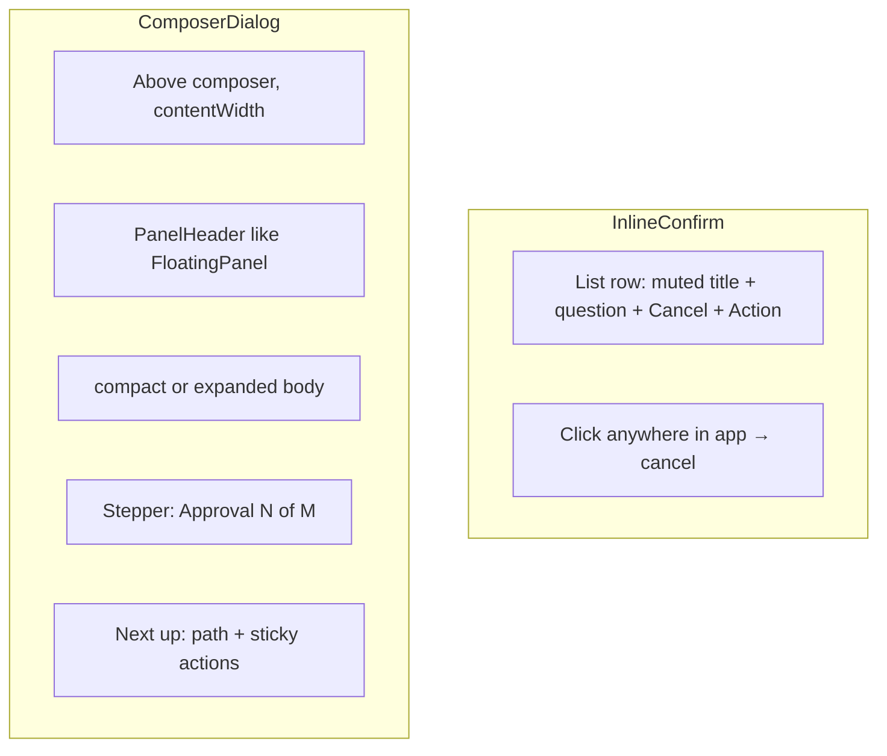

# Dialog & Confirm UX — Redesign Plan (updated)

## Implementation status (codebase today)

Core redesign is **already landed** in:

- [`ComposerDialog.tsx`](src/renderer/components/ui/ComposerDialog.tsx) + [`ComposerDialogAnchor.tsx`](src/renderer/components/ui/ComposerDialogAnchor.tsx)
- [`InlineConfirm.tsx`](src/renderer/components/ui/InlineConfirm.tsx) + [`DestructiveConfirm.tsx`](src/renderer/components/ui/DestructiveConfirm.tsx)
- [`PanelHeader.tsx`](src/renderer/components/ui/PanelHeader.tsx) shared with FloatingPanel
- Dock delete inline in [`DockChatStrip.tsx`](src/renderer/components/dock/DockChatStrip.tsx)
- Edit approval + queue UI in [`EditApprovalDialog.tsx`](src/renderer/components/confirm/EditApprovalDialog.tsx)
- Revert + path prompt on ComposerDialog shell

**Remaining work** is refinement from round 3 (below), not greenfield build.

---

## Confirmed decisions — round 1

| Topic | Choice |
|-------|--------|
| Delete chat | Inline row confirm |
| Shared API | `DestructiveConfirm` wrapper |
| Visual reference | Mini FloatingPanel (Settings aesthetic) |
| Non-delete pattern | Inline where possible; panel when not |
| Mini panel position | Above composer, chat-column width |

## Confirmed decisions — round 2 (new)

### Inline confirm (dock + settings rows)

| Topic | Choice |
|-------|--------|
| Row layout | **Keep chat title visible (muted)** + short question + Cancel/Delete on same row |
| Cancel without button | **Click anywhere in app** dismisses inline confirm |
| Row danger tint | **None** — muted title + buttons only |
| Inline animation | **Instant swap** (crossfade not required) |
| Multiple inline | **Allow multiple** inline confirms simultaneously (dock + settings independent) |
| Settings destructive | **Inline in row** for provider remove, memory discard, etc. |

### ComposerDialog (mini panel above composer)

| Topic | Choice |
|-------|--------|
| Backdrop | **No backdrop** — panel floats with shadow only |
| Composer blocking | **Composer fully usable** while dialog open (non-blocking) |
| Animation | **Fade + 8px slide up (~150ms)**; respect reduced motion |
| Focus | **Trap focus** inside dialog until dismissed |
| Enter key | **Enter triggers primary action** (Delete / Accept) |
| ConfirmHost when Settings open | **Always anchor above composer** — queue until ChatPage mount |
| Path prompt | **ComposerDialog** above composer (same shell) |

### Edit approval

| Topic | Choice |
|-------|--------|
| Actions | **Sticky footer**: Deny \| Accept all \| Accept (always visible) |
| Initial size | **Start compact**: show **first 3 lines of diff** collapsed; tap/expand for full diff |
| Queue indicator | **Combined (option F, refined)**: stepper in header (`Approval 2 of 5`) **+** one-line **"Next up"** preview in footer strip above sticky actions |

### Revert preview

| Topic | Choice |
|-------|--------|
| Container | **Same ComposerDialog shell** above composer as edit approval (shared anchor/chrome) — not inline in timeline |
| Actions | **Keep both** Revert and Edit & resend |

## Confirmed decisions — round 3 (behavioral / refinement)

### ComposerDialog chrome and interaction

| Topic | Choice |
|-------|--------|
| Header | **Same as FloatingPanel** (title + X + hairline via PanelHeader) |
| Buttons | **Shared `Button` component** everywhere (no raw vx-btn in dock delete) |
| Destructive strength | **Two-step**: first action opens confirm; second click Delete confirms in-place |
| Dismiss | **No backdrop** (unchanged); **X / Cancel / Escape only** — no backdrop click dismiss |
| Scroll while open | **Allow scrolling timeline** behind dialog |
| Corners / elevation | **Match FloatingPanel radius**; **border-primary, minimal shadow** |
| Peek/collapse API | **Remove entirely** from codebase |
| Z-index vs floating panels | **Same layer** — last opened wins |
| Animation speed | **~150ms fade+slide** (current OK) |
| Sound | **OS warning sound** on destructive confirm open |
| Accessibility | **aria-modal=true** + **live region** announcing queue position |
| Analytics | **No tracking** |

### Inline confirm behavior

| Topic | Choice |
|-------|--------|
| Click composer while inline open | **Cancels inline confirm** (strict click-away includes composer) |
| Inline + ComposerDialog together | **Both allowed** at once |
| Send while approval open | **Allow send** (no block) |
| Enter key | **Enter always triggers primary** (including Delete) |
| Delete recovery | **Nudge Archive** over Delete (equal icons OK; prefer archive mentally) |
| Double-click trash | **Ignore / guard** double-click on trash icon |
| Narrow window | **Horizontal scroll** inside confirm row |
| Settings layout | **Full row** inline confirm (match dock — refactor ProviderRow) |
| Crossfade | **Instant swap** |

### Edit approval and queue

| Topic | Choice |
|-------|--------|
| Accept all remaining | **Keep prominent** |
| 3-line diff preview | **Usually enough** (user reads every diff) |
| Wording | **Deny** for tool confirms; **Cancel** for user deletes |
| Large queue | **Batch summary** after N items (`Approve 12 edits across 8 files?`) |
| Trust model | User **reads every diff** before approving |

### Agent / revert / workspace

| Topic | Choice |
|-------|--------|
| Delete while run active | **Strong warning**, still allow |
| Archive vs delete | **Equal weight** in dock row |
| Revert while run active | **Warn only**, allow |
| Path prompt | **Folder picker primary** + **recent workspace paths** in prompt |
| Keyboard dock | **Arrow keys** between chats; Enter on focused trash |

---

## Architecture (unchanged core)

Two patterns:

1. **InlineConfirm** — row replaces UI in place (dock, settings lists)
2. **ComposerDialog** — mini FloatingPanel above [`ChatFooter`](src/renderer/pages/ChatFooter.tsx), chat-column width, no backdrop

---

## Queue indicator spec (option F — refined)

When `ConfirmHost` queue length > 1:

**Header (right of title):**
- Stepper pill: `Approval 2 of 5` with subtle amber dot
- Optional stack icon when queue > 2

**Footer strip (above sticky Deny/Accept row):**
- One line muted preview: `Next: edit src/auth.ts (+3 after this)`
- Derive "next" from `pending[1]` payload when edit-approval; generic message otherwise
- Collapses/hides when queue length === 1

---

## Edit approval compact → expanded

**On open (compact):**
- Header row: verb badge + path + diff stats (existing)
- **Collapsed diff preview**: first **3 lines** via `UnifiedDiffPanel` preview mode or truncated hunk
- Control: `Show full diff` / chevron expand
- **Sticky footer** always visible: Deny | Accept all remaining | Accept

**On expand:**
- Body scrolls to max ~60vh; full `UnifiedDiffPanel`
- Footer unchanged (sticky)

---

## Inline confirm — click-away implementation

- Document-level `pointerdown` listener while any inline confirm open
- If target is **outside** the confirming row's DOM subtree → cancel all inline confirms (or per-row if multiple allowed — cancel the row whose subtree wasn't hit)
- **Escape** also cancels inline confirm
- Does not block composer (user can still type — separate from ComposerDialog non-blocking policy)

---

## Revert vs edit approval

Both use **ComposerDialog** with shared:
- `PanelHeader`, mount point, width, animation, focus trap
- Queue stepper/footer when applicable (revert typically single-shot)

Revert keeps file list + expandable diffs + **Revert** and **Edit & resend** primaries in sticky footer.

---

## Files to change (summary)

| File | Change |
|------|--------|
| [`BottomSheet.tsx`](src/renderer/components/ui/BottomSheet.tsx) | Refactor → `ComposerDialog` |
| New [`PanelHeader.tsx`](src/renderer/components/ui/PanelHeader.tsx) | Shared with FloatingPanel |
| New [`InlineConfirm.tsx`](src/renderer/components/ui/InlineConfirm.tsx) | Row-level confirm |
| New [`DestructiveConfirm.tsx`](src/renderer/components/ui/DestructiveConfirm.tsx) | Routes inline vs composer |
| [`DockChatStrip.tsx`](src/renderer/components/dock/DockChatStrip.tsx) | Inline delete; remove BottomSheet |
| [`ChatPage.tsx`](src/renderer/pages/ChatPage.tsx) / [`ChatFooter.tsx`](src/renderer/pages/ChatFooter.tsx) | ComposerDialog mount portal |
| [`ConfirmDialog.tsx`](src/renderer/components/ui/ConfirmDialog.tsx) | ComposerDialog backend |
| [`EditApprovalDialog.tsx`](src/renderer/components/confirm/EditApprovalDialog.tsx) | Compact 3-line diff + queue UI |
| [`RevertPreviewModal.tsx`](src/renderer/components/timeline/revert/RevertPreviewModal.tsx) | ComposerDialog shell |
| [`PromptDialog.tsx`](src/renderer/components/ui/PromptDialog.tsx) | ComposerDialog; move mount from App |
| Settings/dock inline sweep | ProviderRow, MemoryPanel, DockWorkspaceTabs, RunCheckpointCard |
| [`index.css`](src/renderer/index.css) | `.vx-composer-dialog`, `.vx-inline-confirm`; remove banner sheet |

---

## Success criteria

1. No full-width bottom banner dialogs
2. Dock delete: muted title inline row; click-away cancels
3. ComposerDialog: above composer, no backdrop, composer stays usable, focus trap, Enter = primary
4. Edit approval: 3-line diff preview → expand; sticky footer; queue stepper + "next up" footer
5. Revert: same ComposerDialog shell; Revert + Edit & resend retained
6. Multiple inline confirms allowed; settings rows use inline destructive
7. All IPC/queue behavior preserved; tests green

---

## Round 3 implementation notes

### Two-step destructive

Flow for dock delete (and shared `DestructiveConfirm` inline):

1. Trash click → row shows question + single **Delete** (or **Continue**) — not yet destructive
2. Second click **Delete** on that row → executes `onConfirm`
3. Cancel / click-away / Escape resets to idle

Applies to high-impact deletes; composer-variant destructive may use same pattern or single-step for low-risk copy.

### Batch queue summary

When `ConfirmHost` pending edit-approvals exceed threshold (e.g. 5+), offer one summary ComposerDialog:

- `Approve 12 edits across 8 files?` with list expand + Deny all / Approve all
- Fall back to per-file flow when user chooses "Review one by one"

### Click-away + composer tension (documented)

User explicitly chose **composer click cancels inline** AND **composer usable**. Typing in composer will dismiss dock delete confirm — intentional; document in UX or add brief toast "Delete cancelled" if needed.

### Path prompt (picker + recent)

Extend [`PromptDialog.tsx`](src/renderer/components/ui/PromptDialog.tsx):

- Primary action: **Browse folder** (native picker)
- Secondary: paste path field
- Show **recent workspace paths** from settings/workspace store

---

## Explicit non-goals

- No backdrop on ComposerDialog
- No danger row background tint on inline confirms
- Do not block composer send while dialog open
- No usage analytics / telemetry
- Do not re-ask: delete inline, shared wrapper, mini FloatingPanel aesthetic, above composer placement
